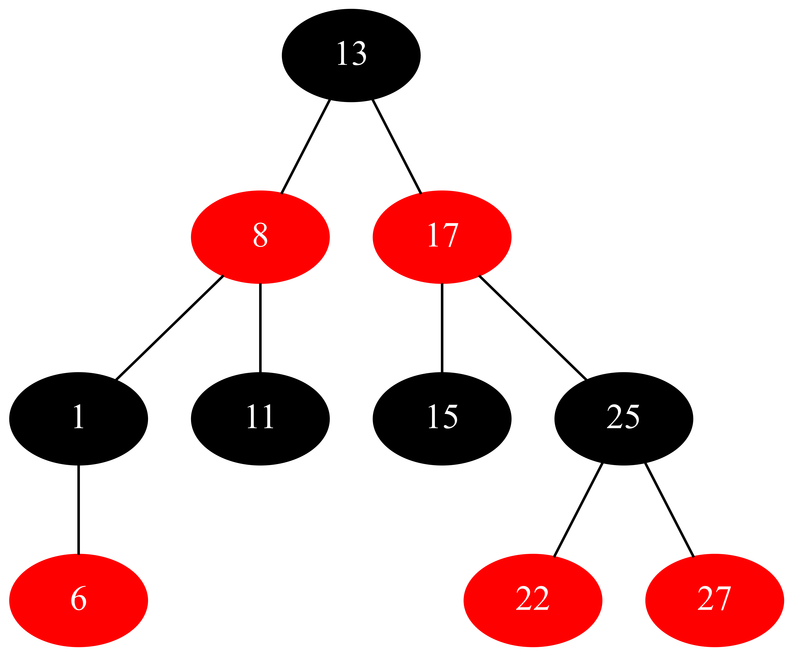
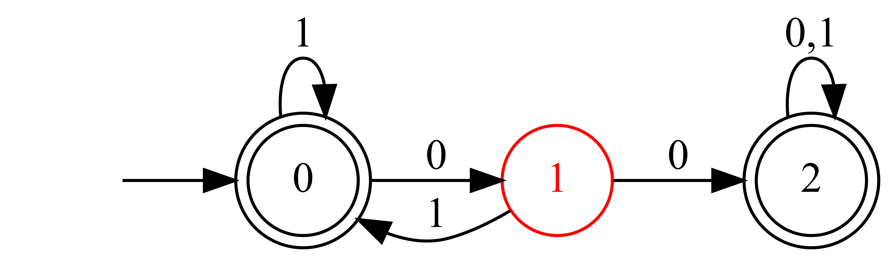

# lwg -- A Lightweight Graph DSL

## Example

### [rb-tree.lwg](example/rb-tree.lwg)

```javascript
undirected.graph

13 > 8 > 17

8 > 1 - 6 > 11

17 - 15 > ^25 > 22 > 27

node.* = {
  fontcolor = 'white'
  style = 'filled'
}
select.node = { 13 1 11 15 25 }
selected.fillcolor = 'black'
select.node = { 8 6 17 22 27 }
selected = {
  color = 'red'
  fillcolor = 'red'
}
```

```bash
$ racket program.rkt -H graphviz rb-tree.lwg rb-tree.dot # lwg -> dot
  ... log ...
$ dot rb-tree.dot -Tpng -o rb-tree.png                   # dot -> png
```



### [automaton.lwg](example/automaton.lwg)

```javascript
0 > 0 > ^1 > 0 > 2 - 2

start.from.0

accept = { 0 2 }

move.*.0 = '1'
move.0.1 = '0'
move.1.2 = '0'
move.2.2 = '0,1'

select.state.1 = { fontcolor color }
selected = 'red'
```

```bash
$ racket program.rkt -H automaton automaton.lwg automaton.dot # lwg -> dot
  ... log ...
$ dot automaton.dot -Tpng -o automaton.png                    # dot -> png
```



## Syntax

### Basic

A `lwg` source consists of graph statements and assignment statements. Graph statements describe skeleton of a graph, while assignment statements describe specific styles. Both graph statements and assignment statements can occur many times and in arbitrary order.

A graph statement define a single node, or multiple nodes connected by edges.

```javascript
^single_node

a - ^b > c >> d
```

Sign `^` indicate that the following node is 'current node'. Every graph statement maintains a independent stack of current nodes, which assists in defining edges. Specifically, edge operator `>` builds a edge from the top node in the stack to the node after it, while operator `-` ignore the stack and always builds a edge from the node before it to the node after it. Furthermore, unary operator `^` push a node to the stack, operator `>>` pop one node from the stack and then do what `>` do, operator `>>>` pop two nodes from the stack and so on. The first node of a chain will be pushed to the stack automatically, like `a` in the above example. Note that to define a graph statement with single node, sign `^` is necessary.

An assignment statement consists of left-value and right-value. A left-value is a symbol(`/[_0-9a-zA-Z]+/`) or a sequence of symbols chained by `.`. Wildcard `*` is also a valid component in left-values. A right-value is a string, single-quoted (`'`) or double-quoted(`"`), or a left-value. Currently, no escape character can be used in the string. A standard form of assignment statement is

```javascript
a.b.c = 'x'
```

Besides, there are several shorthands for assignment statements. Default value `'NIL'` will be used if an assignment statement does not have right-value. Assignment statements sharing common prefix can be grouped by `{}`. Therefore, the following blocks are equivalent:

```javascript
node.text.strong = 'NIL'
node.text.color = 'red'
node.text = 'Root'
run = 'NIL'

node.text = {
  strong
  color = 'red'
  __SELF__ = 'Root'
}
run
```

Note that special name `__SELF__` represents the prefix. The following two statements are equivalent:

```javascript
a.b = 'something'
a.b.__SELF__ = 'something'
```

### Handlers

Although usages of graph statements are clear, specific semantics of assignment statements depend on the type of the graph. Services are basically separated from the core of `lwg` compiler and provided by 'handlers' instead. Handlers are activated by `-H` flag in command-line arguments, and currently, only `graphviz` and `automaton` are defined(See directory [handlers](/handlers)).

`graphviz` is basically a front-end of [DOT](https://graphviz.org/doc/info/lang.html):

```javascript
// graph / digraph
directed.graph
undirected.graph

// Node/Edge attributes
node.a = { label = 'foo', fontcolor = 'bar' }
edge.a.b = { label = 'quz' }

// Default attributes
node.* = { shape = 'none' }
edge.* = { label = 'foo' }
graph = { bgcolor = 'bar' }
```

`automaton` can define ordinary automata:

```javascript
// Starting state and acceptable states
start.from.q0
accept.q1
accept.q2

// δ function
move.q0.q1 = 'input'
move.*.q2 = 'input'

// Node attributes
state.q0 = { fontcolor = 'red' }
```

Note that we borrowed `//` as comment in the demonstrations and it is not a valid token in `lwg`. Both `graphviz` and `automaton` yield a dot file to

- `argv.0`, which is automatically defined by `lwg` and correspoinds to the first command-line argument, or
- `graphviz.output` or `automaton.output` defined by user, or
- screen as a logging message